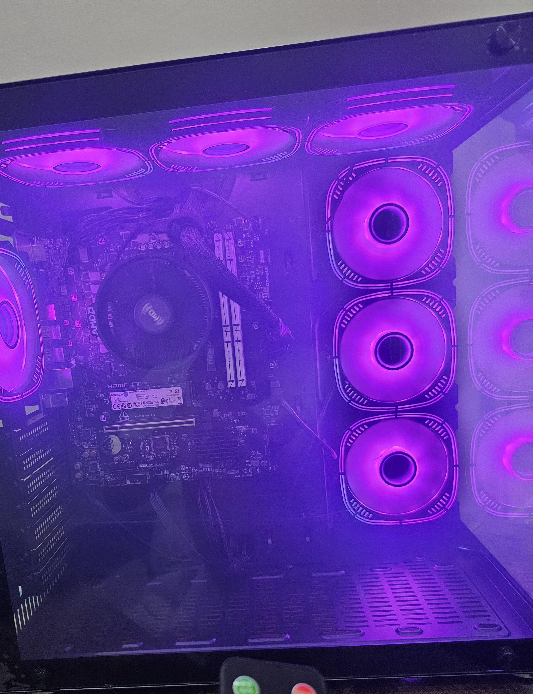

## Overview

This project documents the assembly of a custom-built PC to host my Proxmox homelab environment. It includes part selection, BIOS configuration, and final testing.

---

## Hardware List

| Component    | Model                                                             | Price (SAR) |
|-------------|--------------------------------------------------------------------|-------------|
| CPU         | AMD Ryzen 5 8500G 6-Core 3.5GHz (AM5)                              | 590         |
| Motherboard | MSI PRO A620M-B AM5 mATX                                           | 335         |
| RAM         | Kingston FURY Beast DDR5 64GB (2×32GB) 6000MHz CL30               | 824         |
| SSD         | Kingston NV3 NVMe PCIe 4.0 1TB                                     | 225.30      |
| Case        | GAMEON Emperor Midnight II Series                                  | 269         |
| PSU         | FSP HYPER 80+ PRO 650W 80PLUS Bronze ATX 3.0                       | 245         |

**Total Cost:** ~SAR 2,488

---

## BIOS Configuration

- Enabled **SVM Mode (AMD-V)** for virtualization support  
- Chose **EXPO 1 profile** to allow the RAM to run at its full advertised speed of 6000 MHz  
- Verified boot device priority  
- Confirmed 1×32GB DDR5 recognized (second stick added after initial boot)  
- No BIOS update required  

---

## Result

The system booted successfully after a RAM debug LED issue (resolved by reseating). The machine is now ready for Proxmox installation.

---

## Build Log Screenshots

### Parts & Preparation

  

### Hardware Installation

  

  

  

  

  

  

  

### Power On & Boot

  

### BIOS Settings Confirmation

  

<em>BIOS Fan Info tab showing CPU temperature (47°C), motherboard temp (38°C), and system voltage — confirming stable and cool operation.</em>

  

<em>EZ Mode view confirming EXPO 1 profile is enabled, DDR5 running at 6000 MHz, and boot priorities set correctly.</em>

  

<em>Advanced BIOS view showing <strong>SVM (Secure Virtual Machine)</strong> enabled — required for Proxmox and virtualization.</em>

